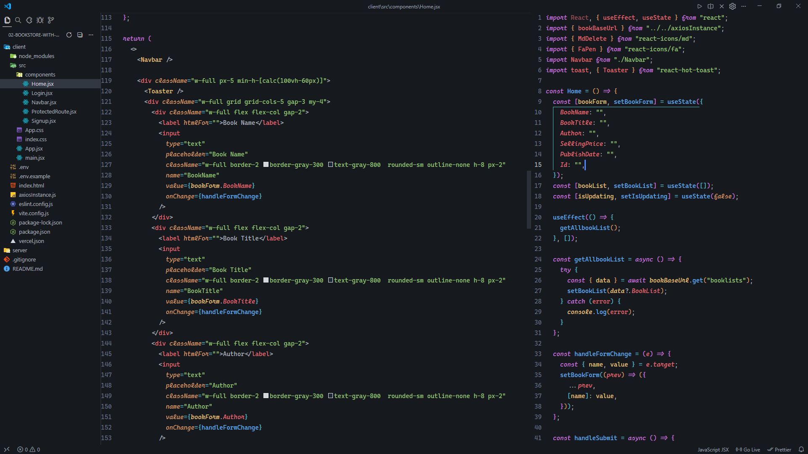

<div align="center">

# ⚡ VS Code Setup — From Zero to Pro

*Install the extensions → paste the settings → done. Your editor will look exactly like this 👇*



</div>

---

## 🧩 Extensions &nbsp;`Ctrl + Shift + X` → search name → Install

| | | | |
|---|---|---|---|
| **One Dark Pro** | **Material Icon Theme** | **Fluent Icons** | **ES7 React/Redux/GraphQL** |
| **Path Intellisense** | **Code Runner** | **Live Server** | **Multiple Cursor Case** |
| **File Tree Extractor** | **Inline Fold** *(by ctf0)* | **Class Collapse** | **Tailwind CSS IntelliSense** |

---

## 🛠️ Tools to Install on Your Computer

> 🔴 **Must have** → 🟡 **Nice to have**

| | | | |
|---|---|---|---|
| 🔴 **VS Code** | 🔴 **[JetBrains Mono](./font/JetBrainsMono-Regular.ttf)** | 🔴 **[Cascadia Code](./font/CascadiaCode-Regular.ttf)** | 🔴 **[Cascadia Code (Italic)](./font/CascadiaCode-Italic.ttf)** | 🔴 **Node.js `v18+`** |
| 🔴 **Git + GitHub Desktop** | 🔴 **Chrome + Firefox** | 🔴 **Postman** | 🔴 **MongoDB Compass** |
| 🟡 **NVM** | 🟡 **VirtualBox** | 🟡 **Rambox** | 🟡 **Obsidian** |
| 🟡 **LocalSend** | | | |

```bash
nvm list            # See installed Node versions
nvm use v18         # Switch to v18
nvm install v24     # Install v24
nvm uninstall v18   # Remove v18
```

---

## ⌨️ Keyboard Shortcuts

<table><tr><td>

**✏️ Editing**

| Shortcut | Action |
|---|---|
| `Alt + ↑ / ↓` | Move line up / down |
| `Ctrl + D` | Select next match |
| `Ctrl + Alt + ↑ / ↓` | Add cursor above / below |
| `Ctrl + Shift + K` | Delete line |
| `Alt + Shift + F` | Format file |

</td><td>

**🗂️ Navigate + View**

| Shortcut | Action |
|---|---|
| `Ctrl + P` | Quick-open file |
| `Ctrl + R` | Recent projects |
| `Ctrl + Shift + O` | Jump to function / var |
| `` Ctrl + ` `` | Toggle terminal |
| `Ctrl + B` | Toggle sidebar |
| `Ctrl + W` | Close tab |
| `Ctrl + Shift + [ / ]` | Fold / Unfold block |

</td></tr></table>

---

## ✍️ Optional — Cursive Font Style 😍

> Want keywords like `const` `function` `return` and all comments to look *italic & elegant*?
> That's exactly what you see in the preview image above. Here's how 👇

**1 — Download & install both fonts** *(right-click the `.ttf` file → Install)*

[](./font/JetBrainsMono-Regular.ttf)
[](./font/CascadiaCode-Regular.ttf)
[-000000?style=for-the-badge&logo=download&logoColor=white)](./font/CascadiaCode-Italic.ttf)

**2 — In `settings.json`, find and replace these 2 lines:**

```json
❌  "editor.fontFamily": "'JetBrains Mono', monospace",
❌  "editor.fontLigatures": true,
```
```json
✅  "editor.fontFamily": "'Cascadia Code', monospace",
✅  "editor.fontLigatures": "'ss01', 'ss02', 'ss03', 'ss04', 'ss05', 'ss06', 'zero', 'onum'",
```

**3 — Paste this before the last `}` in `settings.json`:**

```json
"editor.tokenColorCustomizations": {
  "textMateRules": [{
    "scope": [
      "comment", "entity.name.type.class", "keyword",
      "storage.modifier", "storage.type", "support.class.builtin",
      "keyword.control", "constant.language",
      "entity.other.attribute-name", "string.quoted.single",
      "entity.name.method"
    ],
    "settings": { "fontStyle": "italic" }
  }]
}
```

---

## ⚙️ VS Code Settings

> `Ctrl + Shift + P` → type **Open User Settings (JSON)** → Enter → select all → delete → paste below → `Ctrl + S`

```json
{
  "workbench.startupEditor": "none",
  "workbench.hover.delay": null,
  "workbench.editor.openSideBySideDirection": "right",
  "workbench.sideBar.location": "left",
  "workbench.tree.enableStickyScroll": true,
  "workbench.iconTheme": "material-icon-theme",
  "workbench.tree.renderIndentGuides": "none",
  "workbench.list.smoothScrolling": true,
  "workbench.tree.indent": 15,
  "workbench.editor.showTabs": "none",
  "workbench.editor.limit.value": 1,
  "workbench.editor.limit.enabled": true,
  "workbench.editor.limit.perEditorGroup": true,
  "workbench.layoutControl.enabled": false,
  "workbench.tips.enabled": false,
  "workbench.navigationControl.enabled": false,
  "workbench.secondarySideBar.defaultVisibility": "hidden",
  "workbench.activityBar.location": "top",
  "workbench.editor.enablePreview": false,
  "workbench.colorTheme": "One Dark Pro Night Flat",
  "workbench.productIconTheme": "fluent-icons",
  "window.menuBarVisibility": "toggle",
  "window.title": "${dirty} ${activeEditorMedium}",
  "window.newWindowDimensions": "inherit",
  "window.commandCenter": false,
  "explorer.confirmDragAndDrop": false,
  "explorer.confirmDelete": false,
  "explorer.sortOrder": "type",
  "explorer.compactFolders": false,
  "explorer.confirmPasteNative": false,
  "editor.showFoldingControls": "never",
  "editor.foldingHighlight": false,
  "editor.fontSize": 14.5,
  "editor.fontFamily": "'JetBrains Mono', monospace",
  "editor.fontLigatures": true,
  "editor.lineHeight": 25,
  "editor.cursorWidth": 3,
  "editor.cursorBlinking": "phase",
  "editor.cursorSmoothCaretAnimation": "on",
  "editor.cursorSurroundingLines": 5,
  "editor.mouseWheelZoom": true,
  "editor.renderWhitespace": "none",
  "editor.linkedEditing": true,
  "editor.codeLens": false,
  "editor.copyWithSyntaxHighlighting": false,
  "editor.parameterHints.enabled": false,
  "editor.suggest.insertMode": "replace",
  "editor.hover.enabled": "off",
  "editor.hover.delay": 1500,
  "editor.rename.enablePreview": false,
  "editor.smoothScrolling": true,
  "editor.tabSize": 2,
  "editor.guides.indentation": false,
  "editor.wordWrap": "on",
  "editor.matchBrackets": "never",
  "editor.autoClosingDelete": "always",
  "editor.lightbulb.enabled": "off",
  "editor.guides.bracketPairs": "active",
  "editor.detectIndentation": false,
  "editor.defaultFormatter": "esbenp.prettier-vscode",
  "editor.insertSpaces": false,
  "editor.selectionHighlight": false,
  "editor.overviewRulerBorder": false,
  "editor.renderLineHighlight": "none",
  "editor.occurrencesHighlight": "off",
  "editor.hideCursorInOverviewRuler": true,
  "editor.glyphMargin": false,
  "editor.lineNumbers": "on",
  "editor.formatOnSave": true,
  "editor.suggest.showWords": false,
  "editor.snippetSuggestions": "top",
  "editor.suggest.showInlineDetails": false,
  "editor.suggest.localityBonus": true,
  "editor.accessibilitySupport": "off",
  "editor.formatOnPaste": true,
  "editor.scrollbar.horizontal": "hidden",
  "editor.scrollbar.vertical": "auto",
  "editor.scrollbar.verticalScrollbarSize": 10,
  "editor.minimap.enabled": false,
  "editor.minimap.autohide": "mouseover",
  "editor.minimap.renderCharacters": false,
  "editor.minimap.size": "fit",
  "editor.stickyScroll.enabled": false,
  "diffEditor.ignoreTrimWhitespace": true,
  "diffEditor.hideUnchangedRegions.enabled": true,
  "breadcrumbs.enabled": false,
  "files.autoSave": "afterDelay",
  "files.autoSaveDelay": 1000,
  "files.trimTrailingWhitespace": true,
  "files.trimFinalNewlines": true,
  "terminal.integrated.cursorStyle": "line",
  "terminal.integrated.smoothScrolling": true,
  "terminal.integrated.fontFamily": "'JetBrains Mono'",
  "terminal.integrated.fontWeight": "normal",
  "terminal.integrated.fontSize": 14,
  "terminal.integrated.cursorBlinking": true,
  "terminal.integrated.cursorStyleInactive": "underline",
  "terminal.integrated.stickyScroll.enabled": false,
  "terminal.integrated.initialHint": false,
  "terminal.integrated.showLinkHover": false,
  "terminal.integrated.tabs.focusMode": "singleClick",
  "code-runner.runInTerminal": true,
  "code-runner.ignoreSelection": true,
  "material-icon-theme.hidesExplorerArrows": true,
  "liveServer.settings.donotVerifyTags": true,
  "liveServer.settings.donotShowInfoMsg": true,
  "chat.disableAIFeatures": true,
  "git.autofetch": true,
  "git.openRepositoryInParentFolders": "always",
  "css.lint.unknownAtRules": "ignore",
  "css.lint.vendorPrefix": "ignore",
  "emmet.showSuggestionsAsSnippets": true,
  "js/ts.updateImportsOnFileMove.enabled": "always",
  "emmet.includeLanguages": {
    "javascript": "javascriptreact",
    "typescript": "typescriptreact"
  },
  "search.exclude": {
    "**/node_modules": true,
    "**/dist": true,
    "**/build": true
  }
}
```

---

<div align="center">

**🎉 You're all set up and coding in style!**
*Found this helpful? Drop a ⭐ star on the repo!*

[](../src/Windows%20Optimize.md)

</div>