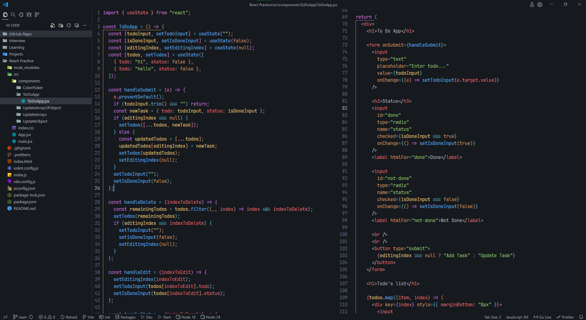

<div align="center">

# ⚡ VS Code Setup

_Extensions → Apps → Shortcuts → Settings — copy, paste, done._



</div>

---

<table align="center">
<tr>
<td valign="top" width="50%">

### 🧩 Extensions &nbsp;`Ctrl + Shift + X`

| Extensions Names              | Extensions Names        |
| ----------------------------- | ----------------------- |
| 1. Code Runner                | 6. Material Icon Theme  |
| 2. ES7 React/Redux/GraphQL... | 7. Multiple Cursor Case |
| 3. File Tree Extractor        | 8. One Dark Pro         |
| 4. Fluent Icons               | 9. Prettier             |
| 5. Live Server                | 10. Tailwind CSS        |

---

### 🖥️ Apps to Install

| Apps Names                                           | Apps Names                                                                                                   |
| ---------------------------------------------------- | ------------------------------------------------------------------------------------------------------------ |
| 1. [VS Code](https://code.visualstudio.com/download) | 5. [JetBrains Mono Font](https://github.com/niladri-1/niladri-1/raw/main/src/font/JetBrainsMono-Regular.ttf) |
| 2. [Node.js](https://nodejs.org/en/download/current) | 6. [NVM (`latest` + `v18`)](https://www.nvmnode.com/guide/download.html)                                     |
| 3. [Git](https://git-scm.com/install/windows)        | 7. [Chrome](https://www.google.com/chrome/what-you-make-of-it)                                               |
| 4. [Postman](https://git-scm.com/install/windows)    | 8. [MongoDB](https://www.mongodb.com/try/download/terraform-provider)                                        |

```bash
nvm list          # see installed version
nvm install v18   # install
nvm use v18       # switch
nvm uninstall v18 # remove
```

</td>
<td valign="top" width="50%">

### ⌨️ Shortcuts

| Shortcut                 | Action                   |
| ------------------------ | ------------------------ |
| `Ctrl + P`               | Quick file open          |
| `Ctrl + R`               | Recent workspaces        |
| `Ctrl + D`               | Select next match        |
| `Ctrl + L`               | Select current line      |
| `Ctrl + W`               | Close tab                |
| `Ctrl + B`               | Toggle sidebar           |
| `` Ctrl + ` ``           | Toggle terminal          |
| `Ctrl + Shift + K`       | Delete line              |
| `Ctrl + Shift + O`       | Go to symbol             |
| `Ctrl + Shift + [` / `]` | Fold / Unfold            |
| `Alt + ↑ / ↓`            | Move line up / down      |
| `Alt + Shift + F`        | Format document          |
| `Ctrl + Alt + ↑ / ↓`     | Add cursor above / below |

</td>
</tr>
</table>

---

## ⚙️ Settings

`Ctrl + Shift + P` → **Open User Settings (JSON)** → select all → paste → save

<details>
<summary>Click to expand settings.json</summary>

```json
{
  "workbench.startupEditor": "none",
  "workbench.hover.delay": null,
  "workbench.editor.openSideBySideDirection": "right",
  "workbench.sideBar.location": "left",
  "workbench.tree.enableStickyScroll": true,
  "workbench.iconTheme": "material-icon-theme",
  "workbench.tree.renderIndentGuides": "none",
  "workbench.list.smoothScrolling": true,
  "workbench.tree.indent": 15,
  "workbench.editor.showTabs": "none",
  "workbench.editor.limit.value": 1,
  "workbench.editor.limit.enabled": true,
  "workbench.editor.limit.perEditorGroup": true,
  "workbench.tips.enabled": false,
  "workbench.navigationControl.enabled": false,
  "workbench.secondarySideBar.defaultVisibility": "hidden",
  "workbench.browser.showInTitleBar": false,
  "workbench.activityBar.location": "top",
  "workbench.settings.enableNaturalLanguageSearch": false,
  "workbench.editor.enablePreview": false,
  "workbench.colorTheme": "One Dark Pro Night Flat",
  "workbench.productIconTheme": "fluent-icons",
  "workbench.editor.editorActionsLocation": "hidden",
  "workbench.layoutControl.enabled": false,
  "window.menuBarVisibility": "toggle",
  "window.title": "${dirty} ${activeEditorMedium}",
  "window.newWindowDimensions": "inherit",
  "window.commandCenter": false,
  "explorer.confirmDragAndDrop": false,
  "explorer.confirmDelete": false,
  "explorer.sortOrder": "type",
  "explorer.compactFolders": false,
  "explorer.confirmPasteNative": false,
  "editor.showFoldingControls": "never",
  "editor.foldingHighlight": false,
  "editor.lineHeight": 23,
  "editor.fontSize": 14.5,
  "editor.fontFamily": "'JetBrains Mono', monospace",
  "editor.fontLigatures": true,
  "editor.cursorWidth": 3,
  "editor.cursorBlinking": "phase",
  "editor.cursorSmoothCaretAnimation": "on",
  "editor.cursorSurroundingLines": 5,
  "editor.mouseWheelZoom": true,
  "editor.renderWhitespace": "none",
  "editor.linkedEditing": true,
  "editor.codeLens": false,
  "editor.copyWithSyntaxHighlighting": false,
  "editor.parameterHints.enabled": false,
  "editor.suggest.insertMode": "replace",
  "editor.hover.enabled": "off",
  "editor.hover.delay": 1500,
  "editor.rename.enablePreview": false,
  "editor.smoothScrolling": true,
  "editor.tabSize": 2,
  "editor.guides.indentation": false,
  "editor.wordWrap": "on",
  "editor.matchBrackets": "never",
  "editor.autoClosingDelete": "always",
  "editor.lightbulb.enabled": "off",
  "editor.guides.bracketPairs": "active",
  "editor.detectIndentation": false,
  "editor.defaultFormatter": "esbenp.prettier-vscode",
  "editor.insertSpaces": false,
  "editor.selectionHighlight": false,
  "editor.overviewRulerBorder": false,
  "editor.renderLineHighlight": "none",
  "editor.occurrencesHighlight": "off",
  "editor.hideCursorInOverviewRuler": true,
  "editor.glyphMargin": false,
  "editor.lineNumbers": "on",
  "editor.formatOnSave": true,
  "editor.suggest.showWords": false,
  "editor.snippetSuggestions": "top",
  "editor.suggest.showInlineDetails": false,
  "editor.suggest.localityBonus": true,
  "editor.accessibilitySupport": "off",
  "editor.formatOnPaste": true,
  "editor.scrollbar.horizontal": "hidden",
  "editor.scrollbar.vertical": "auto",
  "editor.scrollbar.verticalScrollbarSize": 10,
  "editor.minimap.enabled": false,
  "editor.minimap.autohide": "mouseover",
  "editor.minimap.renderCharacters": false,
  "editor.minimap.size": "fit",
  "editor.stickyScroll.enabled": false,
  "editor.suggestOnTriggerCharacters": true,
  "editor.emptySelectionClipboard": false,
  "editor.codeActionsOnSave": {
    "source.sortImports": "always",
    "source.addMissingImports": "always",
    "source.organizeImports": "always",
  },
  "diffEditor.ignoreTrimWhitespace": true,
  "diffEditor.hideUnchangedRegions.enabled": true,
  "breadcrumbs.enabled": false,
  "files.autoSave": "afterDelay",
  "files.autoSaveDelay": 1000,
  "files.trimTrailingWhitespace": true,
  "files.trimFinalNewlines": true,
  "files.eol": "\n",
  "terminal.integrated.cursorStyle": "line",
  "terminal.integrated.smoothScrolling": true,
  "terminal.integrated.fontFamily": "'Source Code', 'Source Code', 'JetBrains Mono'",
  "terminal.integrated.fontWeight": "normal",
  "terminal.integrated.fontSize": 14,
  "terminal.integrated.cursorBlinking": true,
  "terminal.integrated.cursorStyleInactive": "underline",
  "terminal.integrated.stickyScroll.enabled": false,
  "terminal.integrated.initialHint": false,
  "terminal.integrated.showLinkHover": false,
  "terminal.integrated.tabs.focusMode": "singleClick",
  "code-runner.runInTerminal": true,
  "code-runner.ignoreSelection": true,
  "material-icon-theme.hidesExplorerArrows": true,
  "liveServer.settings.donotVerifyTags": true,
  "liveServer.settings.donotShowInfoMsg": true,
  "chat.disableAIFeatures": true,
  "git.autofetch": true,
  "git.openRepositoryInParentFolders": "always",
  "css.lint.unknownAtRules": "ignore",
  "css.lint.vendorPrefix": "ignore",
  "emmet.showSuggestionsAsSnippets": true,
  "emmet.includeLanguages": {
    "javascript": "javascriptreact",
    "typescript": "typescriptreact",
  },
  "js/ts.updateImportsOnFileMove.enabled": "always",
  "prettier.singleQuote": true,
  "prettier.printWidth": 100,
  "prettier.singleAttributePerLine": false,
  "prettier.proseWrap": "always",
  "prettier.htmlWhitespaceSensitivity": "ignore",
  "prettier.semi": true,
  "prettier.tabWidth": 2,
  "prettier.trailingComma": "all",
  "prettier.arrowParens": "always",
  "prettier.bracketSpacing": true,
  "prettier.bracketSameLine": false,
  "prettier.jsxSingleQuote": false,
  "prettier.endOfLine": "lf",
  "telemetry.telemetryLevel": "error",
  "npm.fetchOnlinePackageInfo": false,
  "search.exclude": {
    "**/node_modules": true,
    "**/dist": true,
    "**/build": true,
  },
  "[snippets]": {
    "editor.defaultFormatter": "vscode.json-language-features",
  },
  "files.associations": {
    ".prettierrc": "json",
    ".eslintrc": "json",
    ".stylelintrc": "json",
  },
}

```

</details>
